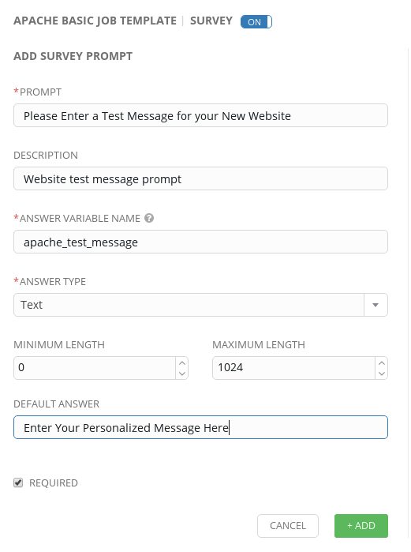

# Extras - Install MSSQL on Windows

Create a Job Template for a MSQL installation. Add a survey that asks for the hostname of the server you wish to deploy on. 

## Import Windows inventory

An instance of Windows has been provisioned for you to install MSSQL on. Import the inventory file ~/studentXX-windows.txt using tower-manage as in previous labs.

```
sudo tower-manage inventory_import --source=<location of you inventory> --inventory-name="Ansible Workshop Inventory"
```

## Create a Machine Credential for Windows

AWS creates random passwords for the Administrator account. We need to create a credential for your instance's Adminstrator account with the generated password. Grab the password from your inventory file and create a credential like you did in previous labs.

## Creating a Job Template

### Step 1:

Select TEMPLATE

### Step 2:

Click on ADD , and select JOB TEMPLATE

### Step 3:

Complete the form using the following values

NAME | Install MSSQL on Windows
-----|-------------------------
DESCRIPTION|Template for the windows playbook
JOB TYPE|Run
INVENTORY|Ansible Workshop Inventory
PROJECT|Ansible Workshop Project
PLAYBOOK|windows-mssql.yml
MACHINE CREDENTIAL|Ansible Windows Credential
LIMIT|windows

<!-- -->

### Step 4:

Click SAVE  and then select ADD SURVEY 

### Step 5:

Complete the survey form with following values

PROMPT|Target hostname
------|------------------------------------------------
DESCRIPTION|hostname of server
ANSWER VARIABLE NAME|limit
ANSWER TYPE|Text
MINIMUM/MAXIMUM LENGTH| Use the defaults
DEFAULT ANSWER| windows

<!--  -->


### Step 6:

Select ADD 

### Step 7:

Select SAVE 

### Step 8:

Back on the main Job Template page, select SAVE  again.

## Running a Job Template

Now that you've sucessfully creating your Job Template, you are ready to launch it.
Once you do, you will be redirected to a job screen which is refreshing in realtime
showing you the status of the job.


### Step 1:

Select TEMPLATES

---
**NOTE**
Alternatively, if you haven't navigated away from the job templates creation page, you can scroll down to see all existing job templates

---

### Step 2:

Click on the rocketship icon  for the *Install MSSQL on Windows*

### Step 3:

When prompted, enter the hostname of your windows instance. You can leave the default 'windows' as that will apply to every node in the windows group. In our case it's only one, but in practice this could be several.

<!--  -->

### Step 4:

Select LAUNCH <!--  -->

### Step 5:

Sit back, watch the magic happen!

This job will execute the tasks in the MSSQL role in the project. This will go through the installation of MSSQL Developer Edition 2017. 

You can explore the role in depth here: https://github.com/mjhermanson/linklight/tree/master/roles/mssql

You can use the variables in this role to manage the configuration lifecycle of the database in the same manner os the code. For example, if you are introducing a code change that will require more resources on the database, you can make that change in git repo and let ansible role out the changes. 


## End Result
At this point in the workshop, you've experienced the core functionality of Ansible Tower.  But wait... there's more! You've just begun to explore the possibilities of Ansible Core and Tower.  Take a look at the resources page in this guide to explore some more features.


---

[Click Here to return to the Ansible Lightbulb - Ansible Tower Workshop](../README.md)
